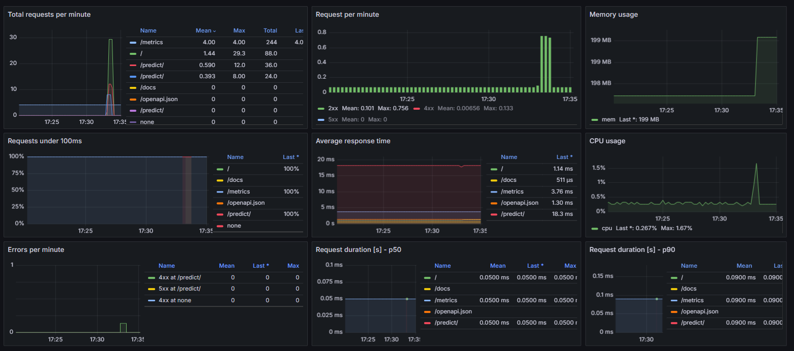

# MLOps Mid-Project: ML Model Deployment for Customer Churn Prediction

This project implements a machine learning model for customer churn prediction, utilizing FastAPI and Apache Beam. It includes a comprehensive MLOps pipeline with monitoring, batch processing, and CI/CD integration.

The presenation of this project can be found here: [Gamma Link](https://gamma.app/docs/Customer-Churn-Prediction-MLOps-System-klmmvju41ctqpmv)

## Features

- FastAPI application for single predictions
- Apache Beam implementation for batch processing
- Monitoring of API and machine with Prometheus
- Error monitoring and alerting with Grafana and Grafana Standing Dashboard
- Automated scheduler for batch processing
- PostgreSQL database for prediction and data storage
- Whylogs data drift monitoring
- Full CI/CD pipeline and testing

## Architecture

1. **Data Collection**: Sources include CSV files in `data/raw` or database queries (fetching only unpredicted data based on the timestamp of the last prediction)
2. **Data Preprocessing**: Data cleaning and transformation for model input (implemented in `beam_preprocessing.py`)
3. **Model Execution**: Running the RandomForestClassifier model on preprocessed data
4. **Output**: Processed data and predictions saved in the `data/batch_results` folder and/or database

### System Architecture Diagram

```mermaid
graph TD
    A[api] -->|depends on| B[db]
    A -->|connects to| C[prometheus]
    D[batch] -->|depends on| B
    C -->|visualized by| E[grafana]
    F[network]
    
    A -->|part of| F
    B -->|part of| F
    C -->|part of| F
    D -->|part of| F
    E -->|part of| F
    
    subgraph Volumes
        G[postgres_data]
        H[grafana_data]
    end
    
    B -->|uses| G
    E -->|uses| H

    classDef default fill:#f9f9f9,stroke:#333,stroke-width:2px;
    classDef service fill:#AED6F1,stroke:#3498DB,stroke-width:2px;
    classDef db fill:#F9E79F,stroke:#F4D03F,stroke-width:2px;
    classDef monitoring fill:#D5F5E3,stroke:#2ECC71,stroke-width:2px;
    classDef network fill:#FADBD8,stroke:#E74C3C,stroke-width:2px;
    classDef volume fill:#8E44AD,stroke:#4A235A,stroke-width:2px,color:#FFFFFF;

    class A,D service;
    class B db;
    class C,E monitoring;
    class F network;
    class G,H volume;
```

### Docker Compose Service Architecture

```mermaid
graph TD
    A[api] -->|depends on| B[db]
    A -->|connects to| C[prometheus]
    D[batch] -->|depends on| B
    C -->|visualized by| E[grafana]
    F[network]
    
    A -->|part of| F
    B -->|part of| F
    C -->|part of| F
    D -->|part of| F
    E -->|part of| F
    
    subgraph Volumes
        G[postgres_data]
        H[grafana_data]
    end
    
    B -->|uses| G
    E -->|uses| H

    classDef default fill:#f9f9f9,stroke:#333,stroke-width:2px;
    classDef service fill:#AED6F1,stroke:#3498DB,stroke-width:2px;
    classDef db fill:#F9E79F,stroke:#F4D03F,stroke-width:2px;
    classDef monitoring fill:#D5F5E3,stroke:#2ECC71,stroke-width:2px;
    classDef network fill:#FADBD8,stroke:#E74C3C,stroke-width:2px;
    classDef volume fill:#8E44AD,stroke:#4A235A,stroke-width:2px,color:#FFFFFF;

    class A,D service;
    class B db;
    class C,E monitoring;
    class F network;
    class G,H volume;
```

### API CI/CD Pipeline

```mermaid
graph TD
    A[Push to main branch<br>or Pull Request] --> B[Check out code]
    B --> C[Set up Python 3.10.12]
    C --> D[Install dependencies]
    D --> E[Run tests]
    E --> F[Build Docker image]
    F --> G{Is it a push<br>to main?}
    G -->|Yes| H[Log in to Docker Hub]
    H --> I[Push image to Docker Hub]
    G -->|No| J[End]
    I --> J

    classDef default fill:#f9f9f9,stroke:#333,stroke-width:2px
    classDef trigger fill:#ff9999,stroke:#333,stroke-width:2px
    classDef step fill:#99ccff,stroke:#333,stroke-width:2px
    classDef decision fill:#ffcc99,stroke:#333,stroke-width:2px
    classDef endClass fill:#ccff99,stroke:#333,stroke-width:2px

    class A trigger
    class B,C,D,E,F,H,I step
    class G decision
    class J endClass
```

## Prerequisites

- Docker Desktop 
- Git 
- Github Account

## Getting Started

### Running the Full Service

1. Navigate to the docker directory:
   ```
   cd docker
   ```

2. Build the Docker images:
   ```
   docker-compose build
   ```

3. Start the services:
   ```
   docker-compose up
   ```

4. Access the API documentation at [http://localhost:8005/docs](http://localhost:8005/docs)

### Testing the API

Use the `/predict/` POST endpoint with the following example body:

```json
{
  "TotalCharges": "1889.5",
  "Contract": "One year",
  "PhoneService": "Yes",
  "tenure": 34
}
```

Expected response: 
```json
{
  "prediction": 0
}
```
(Indicates the client is not likely to churn soon)

## Batch Processing

The batch processing pipeline utilizes Apache Beam for efficient data processing. It runs daily at 12 PM, performing the following steps:

1. Data retrieval from database or CSV files 
2. Data preprocessing 
3. Model execution using the pickled RandomForestClassifier
4. Saving results back to the database or file system

Configure the batch job settings in the 'config' file.

## Real-time API

The FastAPI application provides real-time predictions for the marketing server. It uses the same preprocessing steps and model as the batch process to ensure consistency.

## Monitoring and Alerting

### Prometheus

Prometheus is used to collect metrics from both the API and the batch processing pipeline. Key metrics include:
- Prediction volumes
- Response times
- Error rates
- Model performance metrics

### Grafana

1. Access Grafana at [http://localhost:3000/](http://localhost:3000/)
2. Navigate to "Dashboards"
3. Explore the pre-configured dashboards for:
   - API performance
   - Batch processing metrics
   - Model performance over time
   - Data drift indicators



Alerts are configured in Grafana to notify of any anomalies or issues in the system.

## Database

PostgreSQL is used for storing predictions and raw data.

## Data Drift Monitoring

Whylogs is implemented for data drift detection. Monitor metrics through the Grafana dashboard or custom reports generated in the Whylabs website.

## CI/CD Pipeline

The project includes a full CI/CD pipeline configured with GitHub Actions. View the workflow files in the `.github/workflows/` directory.

## Configuration

To modify input parameters or other configurations, please refer to the configuration files in the `config/` directory.

## License

This project is licensed under the MIT License - see the [LICENSE.md](LICENSE.md) file for details.

## Acknowledgments

[Add any acknowledgments here]

For more information or support, please open an issue in the GitHub repository.
